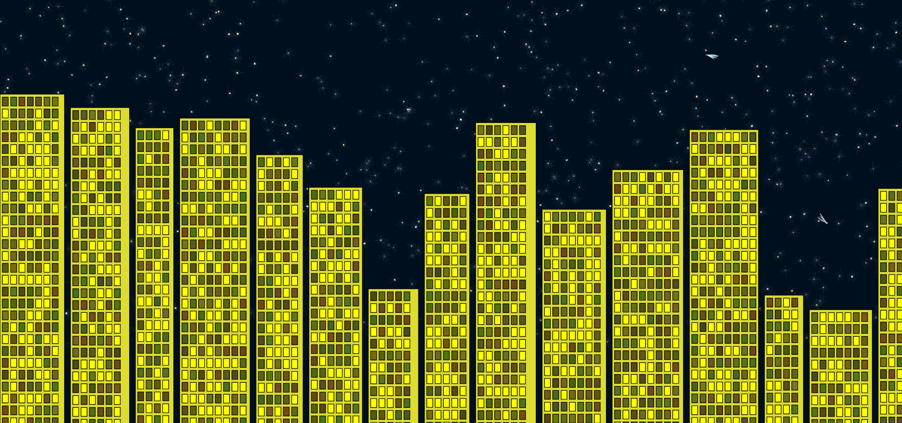

# 🌌 URBAIN – p5.js Project

Une animation interactive en JavaScript utilisant la bibliothèque [p5.js](https://p5js.org/) pour générer un ciel étoilé animé avec étoiles filantes et gratte-ciels dont les fenêtres peuvent être allumées ou éteintes par clic.

## 🎮 Aperçu



- ⭐ Plus de 800 étoiles scintillantes générées aléatoirement  
- 🌠 Étoiles filantes avec queues dynamiques  
- 🏙️ Gratte-ciels générés avec fenêtres cliquables  
- 🎨 Canvas full-screen responsive

## 🛠️ Technologies utilisées

- [p5.js](https://p5js.org/) – Bibliothèque JavaScript pour le dessin et l'interaction créative
- [HTML5](https://developer.mozilla.org/fr/docs/Web/HTML) – Structure de la page web
- [CSS3](https://developer.mozilla.org/fr/docs/Web/CSS) – Mise en forme du canvas et de la page
- [JavaScript](https://developer.mozilla.org/fr/docs/Web/JavaScript) – Logique d’animation et d’interaction


## 🚀 Comment exécuter le projet

### ✅ Étapes

## 🚀 Exécuter le projet

1. Télécharge ou clone le dépôt :
   ```bash
   git clone https://github.com/ton-utilisateur/nom-du-depot.git
   cd nom-du-depot

👉 **Aucun serveur ou installation nécessaire**, tout fonctionne directement.

